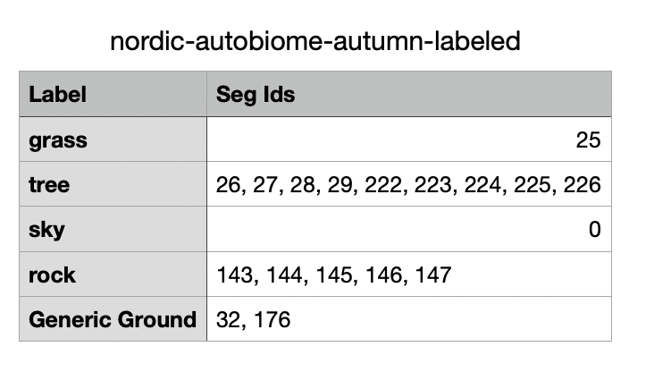

## Introduction

ForestSim is a repository that leverages open-mmlab's MMSegmentation toolbox to train and evaluate semantic segmentation models for object recognition in unstructured off-road environments. The dataset consists of RGB and segmentation image pairs collected using AirSim and Unreal Engine. For more information about the collected dataset, visit the [ForestSim Website](https://vailforestsim.github.io/).

## Platform and Hardware used for Data Collection

**Hardware Specifications:**
- Processor: Intel NUC NUC11PHKi7 11th Gen Core i7-1165G7 Quad-Core (up to 4.70 GHz)
- RAM: 32GB DDR4
- Storage: 1TB PCIe NVMe SSD
- GPU: GeForce RTX 2060 6GB GDDR6
- OS: Windows 11

**Supported Platforms:**

- Windows 11 provides strong support for both Unreal Engine and AirSim, making it ideal for data collection in these CPU and GPU-intensive environments.

- MacOS is also supported, but requires sufficiently capable hardware to run the CPU and GPU-intensive simulation environments.


## Technologies used for data collection
**Epic Games Launcher & Unreal Engine**: Used to install Unreal Engine and download environments suitable for unstructured off-road scenarios.

**AirSim Plugin**: A simulation platform for AI research that provides:
- Programmatic control of ground vehicles (cars) and air vehicles (multirotors)
- Image retrieval capabilities (RGB and segmentation)
- Vehicle state information
- Camera metadata (including intrinsic matrices)

**Python 3.7**: Used to interact with AirSim APIs to automate data collection of RGB and segmentation images from Unreal Engine environments.


## Steps to set up environment

1. **Build AirSim on Windows**
   - Follow the official [AirSim build instructions](https://microsoft.github.io/AirSim/build_windows/)

2. **Install the AirSim plugin**
   - After building, copy the plugin from `Unreal\Plugins` into your Unreal project folder

3. **Set up a custom Unreal environment**
   - Follow the [AirSim custom environment guide](https://microsoft.github.io/AirSim/unreal_custenv/)
   - This can be repeated for any custom environment

4. **Configure vehicle type and settings**
   - AirSim supports two vehicle types: **Car** and **Multirotor**
   - Configure your vehicle type in the `settings.json` file ([configuration guide](https://microsoft.github.io/AirSim/settings/#SimMode))
   - Example `settings.json` files are provided in the `airsim_settings_json` folder (car and multirotor subdirectories)
   - The ForestSim dataset used the car configuration

5. **Place the settings.json file**
   - Ensure `settings.json` is in the correct directory for AirSim and Unreal Engine
   - [Locate the correct directory](https://microsoft.github.io/AirSim/settings/)

6. **Test the AirSim API**
   - Learn how to interact with your vehicle and retrieve images using the [AirSim API documentation](https://microsoft.github.io/AirSim/apis/)


## Process Data

> **Note:** All Python scripts require file paths to be updated for your environment. Only segmentation images require processing; RGB images are used as-is from AirSim.


## Steps to collect data

1. **Launch the Unreal environment**
   - Start your configured Unreal Engine environment with the AirSim plugin
   - Ensure AirSimGameMode is active

2. **Run the vehicle path script**
   - Execute `car_path.py` to programmatically control the vehicle movement:
   ```bash
   python car_path.py
   ```

3. **Collect images in parallel**
   - In a separate terminal, run `car_collect_images.py` to capture RGB and segmentation images at regular intervals:
   ```bash
   python car_collect_images.py
   ```
   - Images will be saved to the specified output folder

> **Note:** File paths in the Python scripts use forward slashes and are configured for cross-platform compatibility. On Windows, you may need to adjust paths if compatibility issues arise.

## Steps to process and consolidate segmentation images

AirSim segmentation images require post-processing before use. Some environments represent the same object class with different RGB values (requiring consolidation), while others assign the same RGB to different classes (making them unusable).

1. **Map segmentation IDs to object classes**
   - Review the class count CSV for your environment
   - Cross-reference segmentation IDs with the [rgb_ids](rgb_ids.csv) file
   - Document the mapping for each unique ID found in your segmentation images

2. **Create a unified class mapping**
   - Define a target RGB value for each object class
   - Use the [Class Mapping](tools/post_processing_code/LabelsWRGBS.csv) as a reference
   - Ensure all environments use consistent RGB values for the same classes

3. **Example mapping**
   - The image below shows how AirSim segmentation IDs map to labeled object classes:
   - 

4. **Convert segmentation images**
   - Use [ProcessSegmentation.py](tools/post_processing_code/ProcessSegmentation.py) to process your images
   - For each pixel, convert its segmentation ID to the corresponding target RGB using your class mapping
   - Reference [rgb_ids](rgb_ids.csv) to look up each ID's current RGB value

## Steps to prepare data for training

1. **Convert to MMSegmentation format**
   - Once segmentation images are consolidated, convert them to MMSegmentation's expected format
   - Pixels should be encoded as single-channel IDs: `[id, id, id]`
   - Example: all grass pixels (class 0) become `[0, 0, 0]`

2. **Relabel and split data**
   - Use [forestsim_relabel_one_dim.py](tools/dataset_converters/forestsim_relabel_one_dim.py) to convert RGB pixels to single-channel IDs
   - Use [forestsim_train_test_split.py](tools/dataset_converters/forestsim_train_test_split.py) to create training/testing splits

3. **Set up MMSegmentation**
   - Install MMSegmentation: [Installation Guide](https://github.com/open-mmlab/mmsegmentation/blob/main/docs/en/get_started.md)
   - Review the [MMSegmentation Documentation](https://mmsegmentation.readthedocs.io/en/main/) for usage details

## Train and test your model

1. **Install the ForestSim repository**
   ```bash
   pip install -e .
   ```

2. **Download and organize data**
   - Download the dataset and place it in the location specified by `data_root` in your config file
   - See the config datasets for the exact path

3. **Review MMSegmentation docs**
   - Read the [MMSegmentation documentation](https://mmsegmentation.readthedocs.io/en/main/) to understand configuration and training
   - Consult the [MMSegmentation tutorial](https://github.com/open-mmlab/mmsegmentation) for workflow examples
